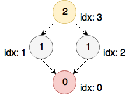

# Motif-based Convolution Neural Network on Graphs

This is a TensorFlow implementation of Motif-CNN, as described in our paper:

Aravind Sankar*, Xinyang Zhang* and Kevin Chen-Chuan Chang [Motif-based Convolutional Neural Network on Graphs] (https://arxiv.org/pdf/1711.05697.pdf). 

This directory contains code to run Motif-CNN. The model takes as input the motif adjacency tensor, node features, and labels to train. The sample code runs subgraph matching to compute motif adjacency tensor.

To run the code, first build `vflib` and put the binary `vflib_3_0_1` under vflib directory.

```bash
cd vflib
cmake .
make
```


Then `cd motif-cnn` and run `python train.py` to start training.


#### Motif input format
You may want to write your own motif pre-computation code. For sake of simplicity, we adopted the subgraph matching tool `vflib` in the example code.

To use the subgraph matching tool included in the code, all motifs used for training should be defined in a json file. `motif_def_dblp_p.json` gives an example.

Take the following motif as an example:



We use numbers inside the nodes to denote node types, text beside the nodes to denote node indices. The target node, context node, and auxiliary node are painted in red, orange, and gray.

The json description of the motif is given by:

```json
{
  "motif_name": {
    "v": [0, 1, 1, 2],
    "e": [[1, 0], [2, 0], [3, 1], [3, 2]],
    "a": [[0], [1, 2], [3]],
    "m": [[0, 3]]
  }
}
```
`"v"` is a list of node types in node index order.

`"e"` is an edge list of the motif.

`"a"` indicates symmetric groups in the motif. In this example, node[1] and node[2] are in symmetric positions, hence they are in the same group. node[0] and node[3] are in separate groups.

`"m"` specifies the (target node, context node) pairs, corresponding to unique semantic roles in the motif (i.e. dimension k of motif adjacency tensor A_kij). In this example, there will one N by N matrix in the returned motif adjacency tensor, corresponding to node[1] in node[0]'s context.

Please cite our paper if you use this code in your own work:

```
@article{sankar2017motif,
  title={Motif-based Convolutional Neural Network on Graphs},
  author={Sankar, Aravind and Zhang, Xinyang and Chang, Kevin Chen-Chuan},
  journal={arXiv preprint arXiv:1711.05697},
  year={2017}
}
```
