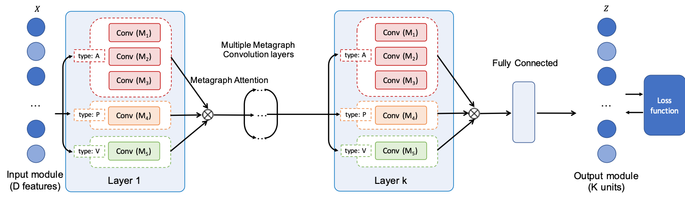

## Metagraph Neural Network for semi-supervised learning on graphs

##### Contributors: [Aravind Sankar](http://asankar3.web.engr.illinois.edu/) (asankar3@illinois.edu),  [Xinyang Zhang](https://github.com/xinyangz) (xz43@illinois.edu).

> Aravind Sankar, Xinyang Zhang and Kevin Chen-Chuan Chang, "Meta-GNN: Metagraph Neural Network for Semi-supervised
learning in Attributed Heterogeneous Information Networks", 2019 IEEE/ACM International Conference on Advances in Social Networks Analysis and Mining, <b>ASONAM 2019</b>, August 27-30, 2019, Vancouver, Canada.

This is a TensorFlow implementation of [Meta-GNN: Metagraph Neural Network for Semi-supervised
learning in Attributed Heterogeneous Information Networks](http://asankar3.web.engr.illinois.edu/files/Meta-GNN-ASONAM2019.pdf). An earlier pre-print of our work can be found at [Motif-based Convolutional Neural Network on Graphs](https://arxiv.org/pdf/1711.05697.pdf).



This directory contains code to run Meta-GNN. The model takes as input the metagraph adjacency tensor, node features, and labels to train. The sample code runs subgraph matching to compute metagraph adjacency tensor.

Note that the code uses the terms motifs and metagraphs interchangeably.

To run the code, first build `vflib` and put the binary `vflib_3_0_1` under vflib directory.

```bash
cd vflib
cmake .
make
```


Then `cd motif-cnn` and run `python train.py` to start training.


#### Metagraph input format
You may want to write your own metagraph pre-computation code. For sake of simplicity, we adopted the subgraph matching tool `vflib` in the example code.

To use the subgraph matching tool included in the code, all metagraphs used for training should be defined in a json file. `motif_def_dblp_p.json` gives an example.

Take the following motif as an example:


We use numbers inside the nodes to denote node types, text beside the nodes to denote node indices. The target node, context node, and auxiliary node are painted in red, orange, and gray.

The json description of the metagraph is given by:

```json
{
  "metagraph_name": {
    "v": [0, 1, 1, 2],
    "e": [[1, 0], [2, 0], [3, 1], [3, 2]],
    "a": [[0], [1, 2], [3]],
    "m": [[0, 3]]
  }
}
```
`"v"` is a list of node types in node index order.

`"e"` is an edge list of the metagraph.

`"a"` indicates symmetric groups in the metagraph. In this example, node[1] and node[2] are in symmetric positions, hence they are in the same group. node[0] and node[3] are in separate groups.

`"m"` specifies the (target node, context node) pairs, corresponding to unique semantic roles in the metagraph (i.e. dimension k of metagraph adjacency tensor A_kij). In this example, there will one N by N matrix in the returned metagraph adjacency tensor, corresponding to node[1] in node[0]'s context.

Please cite our papers if you use this code in your own work:

```bibtex
@article{sankar2017motif,
  title={Motif-based Convolutional Neural Network on Graphs},
  author={Sankar, Aravind and Zhang, Xinyang and Chang, Kevin Chen-Chuan},
  journal={arXiv preprint arXiv:1711.05697},
  year={2017}
}
```

```bibtex
@article{sankar2019meta,
  title={Meta-GNN: Metagraph Neural Network for Semi-supervised learning in Attributed Heterogeneous Information Networks},
  author={Sankar, Aravind and Zhang, Xinyang and Chang, Kevin Chen-Chuan},
  journal={ASONAM. IEEE},
  pages={137--144},
  year={2019}
}
```
